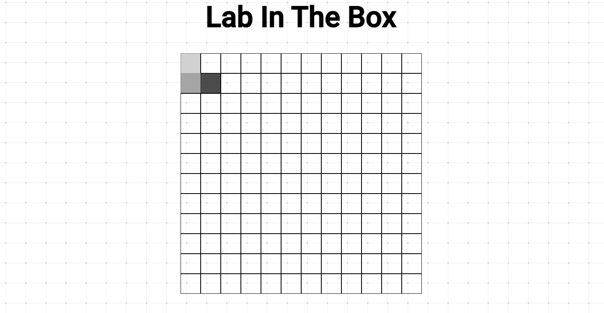
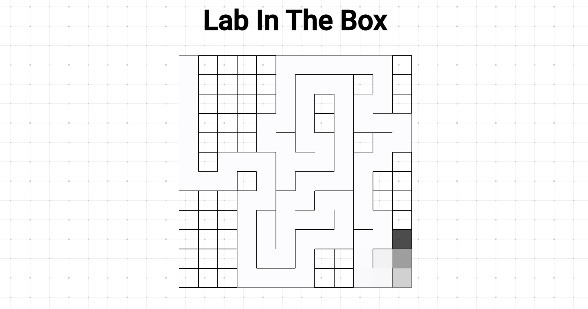
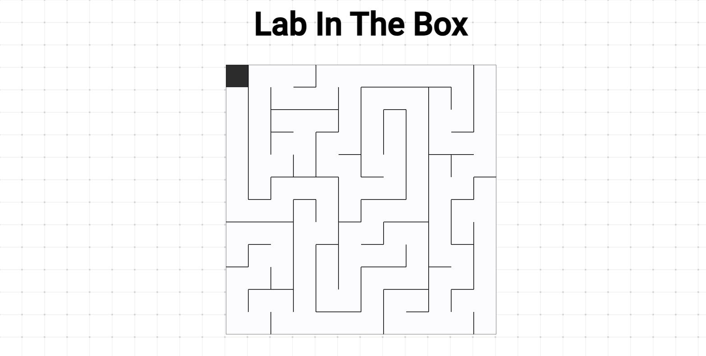

# Lab In The Box

## Gerador de labirinto

**Conteúdo da Disciplina**: Grafos 1<br>

## Alunos

| Matrícula |                        Aluno                        |
| :-------: | :-------------------------------------------------: |
| 190025581 | [Bruno Oliveira Lima](https://github.com/eng-Bruno) |
| --------- |                        ----                         |

## Sobre

Gerador de labirinto utilizando Busca em Profundidade (DFS).

## Screenshots







## Instalação

**Linguagem**:JavaScript<br>

## Como Rodar

Acessar pelo link: https://projeto-de-algoritmos.github.io/Grafos1_LabInTheBox/

ou

Clonar o repositório do projeto:

```
git clone https://github.com/projeto-de-algoritmos/Grafos1_LabInTheBox.git

```

Após clonar o repositório localmente, abrir o arquivo index.html no navegador.

## Apresentação

[Lab In The Box - Grafos 1](./apresentação/Lab%20In%20The%20Box%20-%20Grafos%201.zip) - presente no repositório
